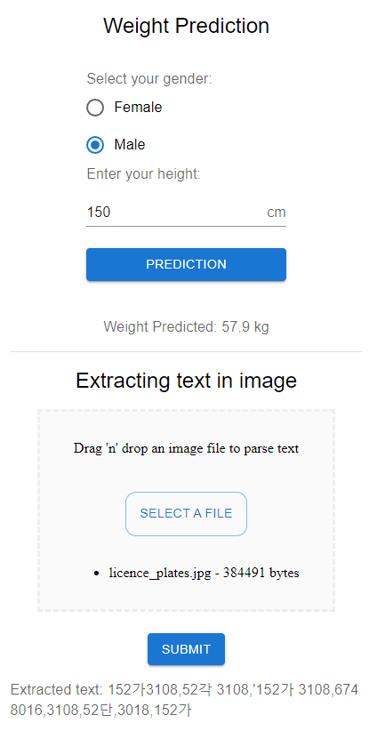

# About this app
Predict weight based on user's gender and height

### Screenshot


### How to run backend and frontend
- Backend
    ```
    (Windows)
    backend>venv\script\activate
    venv>python manage.py runserver
    ```
- Frontend
    ```
    (Windows)
    frontend>npm start
    ```

### How to use
Select your gender and enter your height then click Prediction button

### Packages and Libraries
- Backend
    - Django==4.1.2
    - djangorestframework==3.14.0
    - django-cors-headers==3.13.0
    - scikit-learn==1.1.2
    - pandas==1.5.1
    - numpy==1.23.4
    - joblib==1.2.0
    - easyocr==1.6.2
    
- Frontend
    - "react": "^18.2.0",
    - @mui/material": "^5.10.10"
    - "axios": "^1.1.3"
    - "react-dropzone": "^14.2.3",

### References
- https://betterprogramming.pub/create-a-machine-learning-api-with-django-rest-framework-967571640c46
- https://mui.com/material-ui/react-radio-button/
- https://blog.vivekshukla.xyz/uploading-file-using-api-django-rest-framework/
- https://stackoverflow.com/questions/35522768/django-serializer-imagefield-to-get-full-url
- https://www.jaided.ai/easyocr/tutorial/
- https://testdriven.io/blog/drf-views-part-1/
- https://testdriven.io/blog/drf-views-part-2/
- https://testdriven.io/blog/drf-views-part-3/
- https://testdriven.io/blog/drf-serializers/
- https://blog.logrocket.com/create-drag-and-drop-component-react-dropzone/
- https://react-dropzone.js.org/